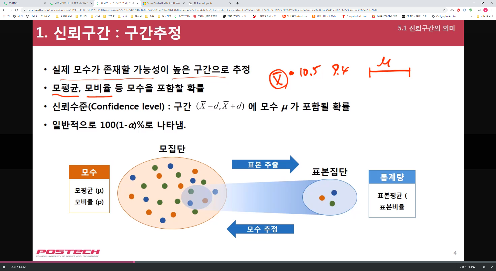
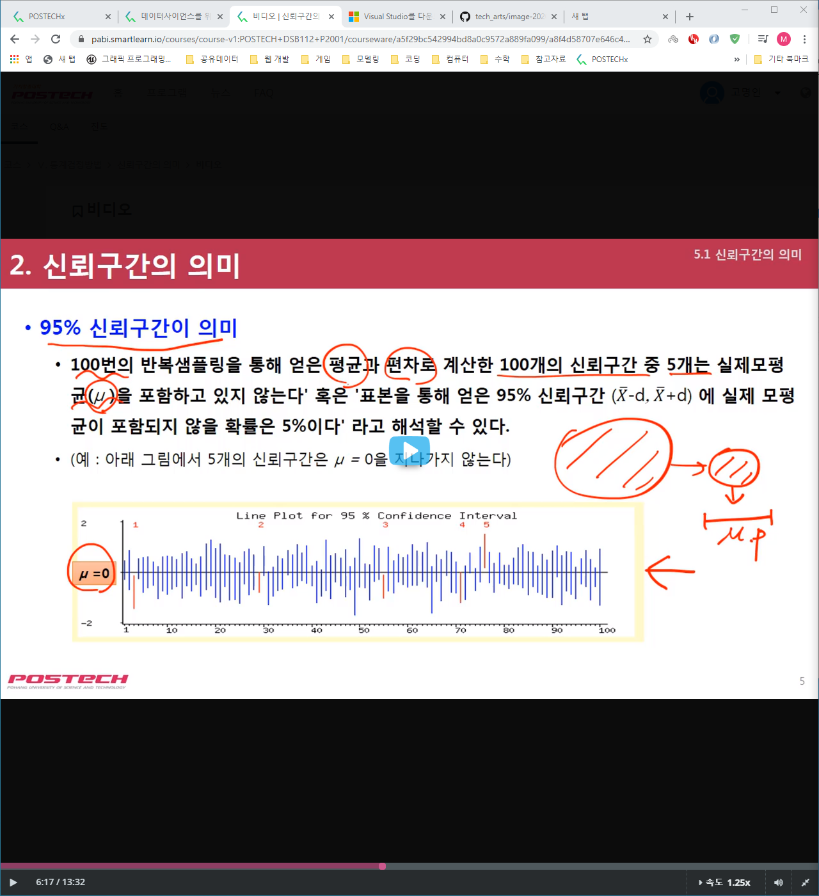

# Data Science

## 1. 데이터 과학과 통계

### 1-1. 데이터 과학이란 무엇인가

* DB 구축 역시 데이터 큐레이션의 범주에 포함됨

* 데이터 과학의 예시

* 핀란드의 의료데이터 프로젝트

### 1-2. 통계가 상식이 된 사회

#### 1-2-1. 통계가 왜 필요한가

#### 1-2-2. 의사결정에서 통계치의 역할

#### 1-2-3. 요약

### 1-3. 데이터 분석과 윤리

#### 1-3-1. 데이터의 정식성

#### 1-3-2. 기사에 등장하는 통계치 해석과 평가

### 1-4. 공유데이터와 오픈소스(github)

#### 1-4-1. 공유데이터란

#### 1-4-2. 오픈소스

## 2. 빅데이터 탐색의 첫걸음

### 2-1. 데이터의 평균(중심위치)

#### 2-1-2. 평균은 요약된 정보

#### 2-1-3. 평균의 공식

#### 2-1-4. 평균을 다룰 때 주의할 점 - 평균과 표본선정

#### 2-1-5. 데이터의 중심척도 요약

### 2-2. 데이터의 분산(산포정도)

#### 2-2-1. 어느 집단의 분산이 클까

#### 2-2-2. 그래프로 그려본 데이터의 산포

#### 2-2-3. 분산의 공식

#### 2-2-4. 분산의 의미

### 2-3. 데이터와 빅데이터

#### 2-3-1. 데이터란 무엇인가

#### 2-3-2. 데이터화(Datafication)

#### 2-3-2. 빅데이터란

#### 2-3-3. 빅데이터 활용 사례

### 2-4. 데이터 탐색의 첫걸음

#### 2-4-1. 통계치로 인사이트를 얻는다.

#### 2-4-2. 최적의 의사결정

#### 2-4-3. 데이터의 숨겨진 패턴을 분석 - 분류

#### 2-4-4. 웹마이닝을 통한 트렌드 분석

* 움직이는 평균 

## 3. 데이터의 시각화와 통계적 해석

### 3-1. 데이터 시각화

#### 3-1-1. 데이터 시각화란?

#### 3-1-2. 데이터 시각화를 하는 이유

#### 3-1-3. 효과적인 데이터 시각화의 조건

#### 3-1-4. 데이터 시각화 도구

#### 3-1-5. 데이터 시각화 예시

* 수치 하나 하나를 파악하기 보다는 전체적으로 파악할 필요가 있음

### 3-2. 그래프의 유용성과 오류

#### 3-2-1. 그래프의 유용성

#### 3-2-2. 어떻게 시각화를 해야 정확한 정보를 제공할 수 있나?

* 데이터를 시각화할때는 어떤 그래프로 그릴 건지, 어떤 축과 범위로 설정할 것인지가 중요

* 그래프의 스케일에 따라 착시 현상이 일어날 수 있음

#### 3-2-5. 데이터 시각화의 주의할 점 

* 그래프의 목적은 데이터를 분명하게 표현하는데 있다.
  * 그래프를 작성할 때 축의 범위, 간격 등을 잘 정해야 한다.
  * 그래프를 보는 사람의 수준을 고려해야 한다.
  * 그래프 종류별 장점과 단점을 정확히 파악하고 사용해야 한다. 

### 3-3. 상자그림이 주는 정보와 해석

#### 3-3-1. 왜 상자그림이 필요한가?

* 평균과 분산만으로는 부족하다. => 기술 통계치만으로는 데이터에 대해 잘 알 수가 없다. 
* 평균 분산을 안다고 데이터가 어느 쪽에 더 많이 분포하는지 알 수 없다.
* 이상치가 존재하느지 알 수 없다.
* 데이터의 분포 범위(최대값, 최소값)을 한눈에 알기 어렵다.

#### 3-3-2. 상자그림이 주는 정보

* 상자그림은 한눈에 5가지 정보를 제공(중앙값, 일사분위수, 삼사분위수, 최대값, 최소값) 
  -> 데이터 분포의 대칭성, 치우침, 이상치를 쉽게 파악할 수 있음!

#### 3-3-4. 상자그림을 그리는 방법

1. 데이터의 중앙값을 찾는다.

   * 중앙값이란? 
     - n개의 관측치를 오름차순으로 배열했을 때 중앙의 위치에 놓이게 되는 값
     - 데이터 수가 작고 이상치가 있을 때 평균보다 더 정확한 모집단의 중심값이 됨

2. 일사분위수(Q1) 과 삼사분위수(Q3)을 찾는다.

   * 일사분위수(Q1) : 데이터를 크기순서로 배열했을 때 25% 지점의 값
   * 삼사분위수(Q3) : 데이터를 크기순서로 배열했을 때 75% 지점의 값

3. 일사분위수 ~ 삼사분위수 상자로 그린다! (사분위범위)
4. 최소값 ~ 일사분위수, 삼사분위수 ~ 최대값을 그린다!
5. 이상치 표시
   * 일사분위로부터 -(1.5)*사분위범위를 넘는 관측치는 이상치로 표시한다.
   * 삼사분위로부터 +(1.5)*사분위범위를 넘는 관측치는 이상치료 표시한다.

#### 3-3-5. 요약

* 상자그림은 다섯가지 숫자로 데이터를 요약한 그래프이다.
  * 가운데 잇는 상자는 Q1에서 Q3까지 그린다.
  * 상자 안에 있는 선은 중앙값을 나타낸다.
  * 상자 밖의 선은 최대값과 최소값까지 이어진다.
  * 상자와 수염 밖의 데이터는 이상치이다.

### 3-4. 산점도와 상관관계 - 트렌드 분석

#### 3-4-1. 왜 산점도가 필요한가?

* 지금까지 히스토그램, 상자그림을 통해 <u>변수 1개의 데이터 분포</u>를 살펴봄
* 그렇다면 <u>두 변수 사이의 관계</u>는 어떻게 알 수 있을까?

* 산점도에서는 변수 간 관계의 방향, 트렌드, 강도를 살펴볼 수 있음

* 산점도의 x축과 y축은 독립변수와 종속변수로 이루어짐
* 독립변수(Independent/Explanatory variable) : 원인의 역할을 하는 변수, X
*  종속변수(Dependent/Response variable) : 결과를 관측하는 변수, Y
* 산점도로부터 알 수 있는 3가지
  1. 트렌드 : linear, curved, clusters, no pattern
  2. 방향 : positive, negative, no direction
  3. 강도 : how closely the points fit the trend

#### 3-4-2. 산점도의 해석 - 방향

* 두 변수 X와 Y가 X 값이 클 때 Y 값도 큰 경향이 있고, X값이 작을 때 Y값도 작은 경향이 있다면?
  -> 양의 상관관계에 있음(Positively associated!)
* 두 변수 X와 Y가 X값이 클 때 Y값이 작은 경향이 있고, X값이 작을 때 Y값이 큰 경향이 있다면?
  -> 음의 상관관계에 있음!(Negatively associated!)

#### 3-4-2. 산점도의 해석 - 상관계수

* 상관관계의 강도를 나타내는 것이 상관계수(Correlation,r)

$$
r= 1/(n-1)Σ(x-)
$$

r은 -1 부터 +1까지 존재하며, +1에 가까울 수록 강한 양의 상관관계, -1에 가까울수록 강한 음의 관계에 있음!

0은 가장 약한 상관관계를 의미함(상관관계가 없음)

* 산점도에서 상관관계란 선형적인(linear) 상관관계만 의미함!
  * 두 변수를 한 직선으로 표현할 수 있지 않을까?
  * 이 직선을 토대로 임의의 X값에 대한 Y값을 예측할 수 있지 않을까?

#### 3-4-3. 요약

* 산점도는 두 변수 간 관계의 방향, 형태, 강도를 살펴볼 수 있는 그래프이다.
* 상관계수(r)는 두 변수 간 선형적인 상관관계의 강도를 나타낸다.
* 산점도에서 선형모형(선형함수식)을 구현할 수 있다. 

## 4. 빅데이터 분석에서 확률과 분포

### 4-1. 확률의 기초개념

#### 4-1-1. 통계에서 확률 개념은 왜 필요한가?

통계(Statistics) ~= 확률(Probabilities)

* 통계란 데이터를 수집, 처리, 분석, 활용하는 지식
  -> 실제 얻어진 데이터를 바탕으로 정보를 도출
* 확률이란 어떤 특정한 사건이 일어날 가능성을 0과 1 사이의 값으로 나타낸 것
  -> 관측하기 전에 있어서 가능성을 논하는 것
* 현실 세계는 매우 랜덤하기 때문에 미리 그 결과를 알 수 없다.
  -> 단기적으로 어떠한 사건이 일어날 비율은 매우 랜덤!
* 하지만 장기적으로 어떤 사건이 일어날 가능성은 확률적으로 예측 가능하다!
  -> 사건 하나하나에 대해서 미리 아는 것은 불가능하더라도 확률적 모형을 통해 많은 시행의 결과를 예측할 수 있음

#### 4-1-2. 통계에서 필요한 확률 - 확률, 사건, 표본공간

* 확률 : 어떤 특정한 사건이 일어날 가능성을 0과 1사이의 값으로 나타낸 것
* 사건 : 표본공간에서 관심의 대상인 부분집합
* 표본 공간 : 확률실험의 모든 가능한 결과의 집합 
* P(A) = 사건  A가 일어나는 경우의 수 / 모든 가능한 결과의 수 
* 합집합 사건 : 사건 A 또는 사건 B가 일어날때, P(A U B) = P(A) + P(B) - P(A ∩ B)
* 교집합 사건 : 사건 A와 사건 B가 동시에 일어날 때, P(A ∩ B)
* 여집합 사건 : 표본공간 S에서 사건 A가 일어나지 않을 때, P(A^C) = 1 - P(A)
* 배반사건 : 교집합사건이 공사건일 때, 사건 A와 B가 서로 배반(Mutually exclusive)

#### 4-1-3. 통계에서 필요한 확률 - 확률변수와 기대값

* 확률변수 : 확률 실험으로부터 나타난 결과에 실수를 할당한 함수
* 기대값 : 확률 변수의 중심척도로, 어떤 랜덤한 상황에서 수치로 나타난 결과가 A1, A2, ... ,Ak이고 각 결과의 확률이 P1, P2, ... , Pk이면 기대값은 각 결과에 확률을 곱하여 전부 합한 것 기대값 =  A1P1+A2P2+ ... + AkPk

### 4-2. 조건부 확률과 베이즈 확률

#### 4-2-1. 조건부 확률과 통계적 독립

* 두개의 주사위를 던져 두 눈의 합이 10일 확률은 1/12이다. 그런데 누가 첫번째 주사위의 눈이 4라는 것을 미리 알려주었다. 이때 두 눈의 합이 10일 확률은 몇인가? 1/6
* 조건부 확률(Conditional probability) : 어떤 사건(B)이 발생한다는 조건 하에서 다른 사건(A)이 발생하게 될 확률
* P(A|B) = P(A ∩ B) / P(B)
* P(A|B) = P(A) 일때, 즉 사건 B가 일어난다는 정보가 사건 A의 발생에 전혀 영향을 주지 않을 때 두 사건이 통계적 독립이라고 한다. 

#### 4-2-2. 베이즈 정리

Formula

|  | =    | events                                   |
| ------------------------------------------------------------ | ---- | ---------------------------------------- |
|  | =    | probability of A given B is true         |
|  | =    | probability of B given A is true         |
|  | =    | the independent probabilities of A and B |

* 주어진(사전정보)가설에 새로운 정보(B)가 주어졌을 때 사후확률을 계산한다. 

* 베이즈 정리란 사후확률을 사전확률과 가능도를 이용하여 계산할 수 있도록 해 주는 확률 변환식이다. 
* 머신러닝기법 중  '나이브베이즈 분류' 기번 계산에서 베이즈 정리가 활용된다. 

### 4-3. 정규분포(연속형)와 포아송분포(이산형)

#### 4-3-1. 확률분포란?

* 만약 확률변수 X가 1, 2.5, 4의 값을 갖고 각각에 대한 확률이 P(X=1) = 1/2, P(X=2.5) =1/3, P(X=4) =1/6 라면?

| x      | 1    | 2.5  | 4    | 계   |
| ------ | ---- | ---- | ---- | ---- |
| P(X=x) | 1/2  | 1/3  | 1/6  | 1    |

* 이렇게 표로 나타날 새도 있지만... 

* 함수와 그래프로 나타낼 수도 있다. -> 확률변수에 대한 분포 = 확률분포

* 확률분포에는 이산형(discrete)분포와 연속형(continuous)분포가 있다.

#### 4-3-2. 이산형분포

* 이산형 분포란 확률변수가 이산형(discrete)일 때의 확률분포이다!
* 이산확률변수 X가 특정한 값(x)를 취할 확률 값을 p(x)로 표기할 때

(1) 기대값 E(X) = Σx*p(x)(가중치 평균의 개념)

(2) 분산 Var(x) = E(X^2) - E(X)^2

#### 4-3-3. 이산형 분포 - 이항 분포

* 이산형 분포에는 이항분포, 다항분포, 초기화분포, 포아송분포 등이 있다.
* 어떤 시행의 결과가 단순히 '성공' 또는 '실패'로 나타날 수 있을 때(베르누이시행), 이항분포란 '성공'이 나오는 횟수에 대한 확률분포이다!
* 성공확률이 p인 베르누이시행을 n회 반복할 때 성공의 횟수 X에 대하여 

#### 4-3-4. 이산형 분포 - 포아송 분포

* 포아송분포란 단위 시간 안에 어떤 사건이 몇 번 발생하는가에 대한 확률분포이다! 
* 확률 변수 X가 포아송확률변수이고, 모수(평균발생횟수)가 λ라면

포아송 분포는 다양한 현실세계의 문제와 밀접한 관련이 있다. 

- 일정 주어진 시간 동안에 도착한 고객의 수
- 일정 주어진 생산시간 동안 발생하는 불량 수 
- 1킬로미터 도로에 있는 흠집의 수
- 어떤 특정 량의 방사선을 DNA에 쬐였을 때 발생하는 돌연변이의 수

#### 4-3-5. 연속형 분포란?

* 연속형 분포란 확률변수가 연속형(continuous)일 때의 확률분포이다.

* 정규분포는 평균을 중심으로 대칭을 이루는 종모양의 연속확률분포이다. 

* 표준정규분포는 평균이 0이고 분산이 1인 정규분포이다. 
* 정규분포를 표준정규분포로 만드는 방법은 간단하다!

* 카이제곱분포

* F-분포

#### 4-3-6. 요약

* 이산형 분포란 확률변수가 이산형일 때의 확률분포이다. 
* 이항분포란 베르누이 시행에서 '성공'이 나오는 횟수에 대한 확률분포이다.
* 포아송 분포란 단위 시간 안에 어떤 사건이 몇 번 발생하는가에 대한 확률분포이다. 
* 연속형 분포란 확률변수가 연속형 일 때의 확률분포이다.
* 정규분포는 평균을 중심으로 대칭을 이루는 종모양의 연속확률분포이다. 

### 4-4. 데이터에서 출발하는 확률과 분포

#### 4-4-1. 데이터의 분포를 아는 경우

* 대학생 20명을 대상으로 생활습관에 대한 설문조사를 하였다. 
* 그리고 이 학생들의 특성을 기준으로 '보통(0)'과 '우수(1)' 학생으로 구분하였다.
* 한 학생의 생활습관이 주어졌을 때 이 학생을 어떻게 분류할 수 있을까?

"학생들은 타겟값이 0또는 1인 이항분포를 따름, 학습 표본을 기반으로 분류 규칙을 생성" -> 로지스틱 회귀분석!

* 데이터의 분포(특성)를 알고 있다면, 목적에 따라 데이터를 분석하는 것이 수월해진다!
*  하지만 현실 세계의 데이터 분포는 무수히 많을 정도로 다양하고 우리가 아는 분포(ex. 포아송분포)로 설명할 수 없는 분포도 분명히 존재한다.
* 만일 그 많은 다양한 분포들을 한 종류의 분포로 근사하여 설명할 수 있다면 어떨까? ->중심극한정리

#### 4-4-2. 중심극한정리(Central Limit Theorem)

* 이항분포에서 표본의 수가 증가함에 따라 표본들의 전체 합이 점점 정규분포에 근접해짐!
* 지수 분포에서도 표본 수의 증가에 따른 표본평균의 분포는 점점 정규분포와 비슷해짐을 볼 수 있음!
* 원래 분포가 정규분포가 아니더라도 표본의 수가 증가함에 따라 표본평균이 점점 정규분포모형과 비슷해짐!
* 중심극한정리 : 모집단이 정규분포가 아닌 경우에도 표본의 수가 증가하면 표본평균의 분포가 정규분포에 근접한다. 
* 평균이 μ이고 분산이 σ^2인 모집단으로부터 크기 n인 확률표본을 추출할 때, n이 크면 표본평균 x̅는 N(μ, σ^2/n)에 근접한다.
* 보통 n이 30 이상이면 모집단의 분포에 관계없이 x̅는 정규분포에 근사한다.
* 중심극한정리가 유용한 이유
  * 대부분의 통계적 검정과 추정은 모집단이 정규분포를 따른다는 가정 하에서 이루어짐 
    -> 모집단의 분포를 몰라도 중심극한정리를 이용하면 표본평균의 통계적 검정과 추정이 가능해짐!

* 참고교재 : David S. Moore, William I. Notz, 심규박, 이승수 옮김, 개념과 논쟁으로 배우는 통계학, 2018
* Agresti, A., Franklin, C., Statics, The Art and Science of Learning from Data, 3rd ed, 2014

## 5. 통계검정방법

### 5-1. 신뢰구간의 의미

#### 5-1-1. 신뢰구간 : 구간추정

* 실제 모수가 존재할 가능성이 높은 구간으로 추정
* 모평균, 모비율 등 모수을 포함할 확률
* 신뢰수준(Confidence level) : 구간 (x̅-d, x̅+d)에 모수 μ가 포함될 확률
* 일반적으로 100(1-α)%로 나타냄. 

#### 5-1-2. 신뢰구간의 의미

* '100번의 반복샘플링을 통해 얻은 평균과 편차로 계산한 100개의 신뢰구간 중 5개는 실제모평균(μ)을 포함하고 있지 않는다.' 혹은 '표본을 통해 얻은 95% 신뢰구간(x̅-d, x̅+d)에 실제 모평균이 포함되지 않을 확률은 5%이다' 라고 해석할 수 있다. 

#### 5-1-3. 몇 % 신뢰구간을 선택할 것인가

* 몇 퍼센트의 신뢰구간이 적당한가?

* 정확도를 생각할 때는 좁은 게 좋다. 

* 90%, 95%, 99% 신뢰구간 비교
  -> 여론조사에서 95% 신뢰구간을 사용하는 이유는 무엇일까

#### 5-1-4. 표본사이즈와 허용오차

* 허용오차를 일정수준으로 정하면
  -> 그에 따른 표본크기가 정해진다. 

#### 5-1-5. 요약

* 실험 및 조사설계를 할 때 허용오차 및 신뢰수준을 고려해야 정확한 분석이 가능

### 5-2. 통계적 검정은 왜 필요한가

#### 5-2-1. 통계적 검정이란?

* 가설의 진위 여부를 판단, 증명, 검정하는 통계적 추론 방식
|                 귀무 가설                  |                          대립가설                           |
| :----------------------------------------: | :---------------------------------------------------------: |
| 검정 대상이 되는 가설 기각을 목표로함 | 귀무가설이 기각될때 받아들여지는 가설  채택을 목표로함 |

* 가설 검정의 절차 

가설 설정 -> 유의 수준 설정 -> 검정통계랑 산출 -> 가설 기각/채택

* 단측검정 / 양측검정

#### 5-2-2. t-분포를 이용한 검정

한 집단 혹은 두 집단 간 평균 차이에 대한 통계적 검정 방법

* T-distribution
  * 많은 사회 현상은 평균 데이터가 많기 때문에 정규 분포(Normal distribution)의 형태
  * 정규 분포는 표본의 데이터 수가 많아야 신뢰도 향상(일반적으로 30개 이상)
  * 데이터가 적은 경우 예측 범위가 더 넓은 T-disribution 사용
* T-test의 가정
  * 독립성 : 두 집단의 변수는 서로 독립이다. 
  * 정규성 : 두 집단의 데이터는 정규분포를 만족한다. 
  * 등분산성 : 두 집단의 분산은 동일하다. 

### 5-3. 두집단 t-검정 

#### 5-3-1. 두집단 간 평균비교

* 목적 : 콘크리트 압축 강도에 대해서 수분함량에 따라 차이가 있는지 조사
* 데이터 : 

